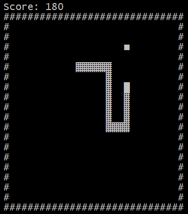

# Snake Game
Text-based Snake Game

I code this for a minor assigment at the Basic Project 1 class. I tried to do it all without searching for open source codes. So I almost did it, until I got stuck because I didn't know how to input keys without showing them on terminal. So I had to search for that command on internet called kbhit().

## Skills
- C Language
- Entering Keys Without Showing It (kbhit())
